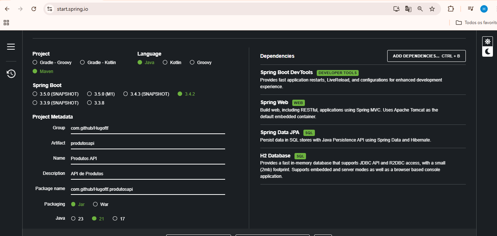
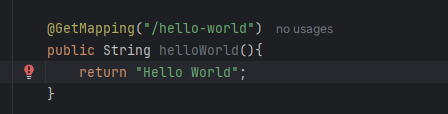
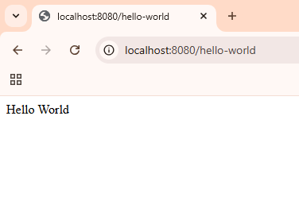

# Projeto API

 - [Sobre](#Sobre) 
 - [Inicio](#Inicio)

## Sobre

Um exemplo de criação e uso de uma API com o spring. Utilizei o site "https://start.spring.io/" para criar as configurações do meu projeto:

No site você consegue configurar que tipo de depndência, linguagem, versão, etc. Para este projeto vou utilzar um banco h2 em memória para exemplicar minha API.

## Inicio

Antes de começar os trabalhos, realizei um teste de hello world para vê se estava tudo Ok, criei um metodo hello world que retorna uma string com a anotação Get mapping: 

Rodou perfeitamente, e retornou: 

